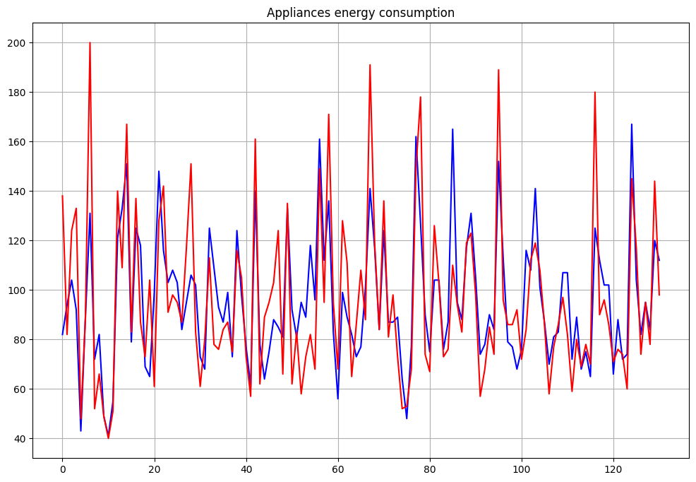
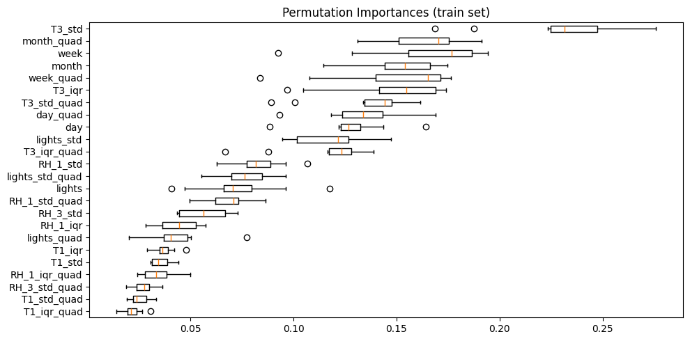

# Project with Feedback Number 8: Data Science Academy Data Scientist Bootcamp
## Predictive Modeling in IoT - Energy Usage Forecasting

This IoT project aims to create predictive models for forecasting the energy consumption of appliances. The data used includes measurements from temperature and humidity sensors in a wireless network, weather forecasts from an airport station, and energy usage by light fixtures.

In this machine learning project, you should perform data filtering to remove non-predictive parameters and select the best features for prediction. The dataset was collected over 10-minute periods for about 5 months. The temperature and humidity conditions of the house were monitored with a ZigBee wireless sensor network.

Each wireless node transmitted temperature and humidity conditions approximately every 3 minutes. Then, the average of the data was calculated for 10-minute periods. Energy data was recorded every 10 minutes with m-bus energy meters. The weather from the nearest airport weather station **(Chievres Airport, Belgium)** was downloaded from a public dataset from Reliable Prognosis **(rp5.ru)** and merged with the experimental datasets using the date and time column. Two random variables were included in the dataset to test regression models and filter non-predictive attributes (parameters).

Your task now is to build a predictive model that can forecast energy consumption based on the collected IoT sensor data. We recommend using **RandomForest** algorithm for feature selection and **SVM, Multilinear Logistic Regression, or Gradient Boosting** for the predictive model. The training and test datasets are attached to this PDF.

### Data Dictionary

1. `date`: Date and time of measurement (recorded every 10 minutes)

2. `Appliances`: Energy consumption of appliances in Wh (Watt-hour)

3. `lights`: Energy consumption of light fixtures in Wh (Watt-hour)

4. Temperature and humidity sensors from ZigBee network (10-minute average):
   - `T1` to `T9`: Temperature at different points in the house (°C)
   - `RH_1` to `RH_9`: Relative humidity corresponding to each temperature sensor (%)

5. Weather data from Chievres Airport:
   - `T_out`: Outside temperature (°C)
   - `Press_mm_hg`: Atmospheric pressure (mm of mercury)
   - `RH_out`: Outside relative humidity (%)
   - `Windspeed`: Wind speed (likely in m/s)
   - `Visibility`: Visibility (likely in km)
   - `Tdewpoint`: Dew point temperature (°C)

6. Random variables (included for model testing):
   - `rv1`: Random variable 1
   - `rv2`: Random variable 2

7. Time-related variables:
   - `NSM`: Number of minutes since midnight
   - `WeekStatus`: Indicates whether it's a workday or weekend
   - `Day_of_week`: Day of the week (1-7)

Important notes:
- Temperature and humidity data (T1-T9, RH_1-RH_9) are collected approximately every 3 minutes and then averaged for 10-minute periods
- Energy consumption (Appliances and lights) is recorded directly every 10 minutes
- Variables rv1 and rv2 should be discarded in the analysis as they are non-predictive by definition
- Weather data comes from an external source (rp5.ru) and was merged using the date/time

## Results

###

###

###

###

###

###

###

###

###

###

###

###

###

###

###

###

###

## Summary of the Key Findings

## Real-world Scenario Usage

## Acknowledgements

## MIT License

Copyright (c) [2025] [Dr. Vagner Zeizer Carvalho Paes]

Permission is hereby granted, free of charge, to any person obtaining a copy
of this software and associated documentation files (the "Software"), to deal
in the Software without restriction, including without limitation the rights
to use, copy, modify, merge, publish, distribute, sublicense, and/or sell
copies of the Software, and to permit persons to whom the Software is
furnished to do so, subject to the following conditions:

The above copyright notice and this permission notice shall be included in all
copies or substantial portions of the Software.

THE SOFTWARE IS PROVIDED "AS IS", WITHOUT WARRANTY OF ANY KIND, EXPRESS OR
IMPLIED, INCLUDING BUT NOT LIMITED TO THE WARRANTIES OF MERCHANTABILITY,
FITNESS FOR A PARTICULAR PURPOSE AND NONINFRINGEMENT. IN NO EVENT SHALL THE
AUTHORS OR COPYRIGHT HOLDERS BE LIABLE FOR ANY CLAIM, DAMAGES OR OTHER
LIABILITY, WHETHER IN AN ACTION OF CONTRACT, TORT OR OTHERWISE, ARISING FROM,
OUT OF OR IN CONNECTION WITH THE SOFTWARE OR THE USE OR OTHER DEALINGS IN THE
SOFTWARE.
